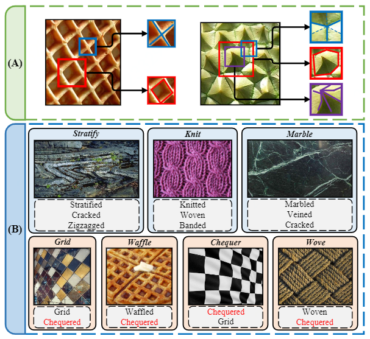
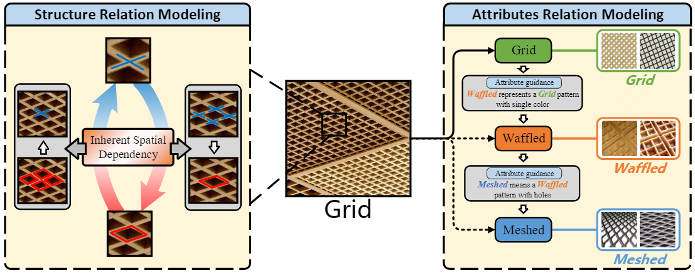
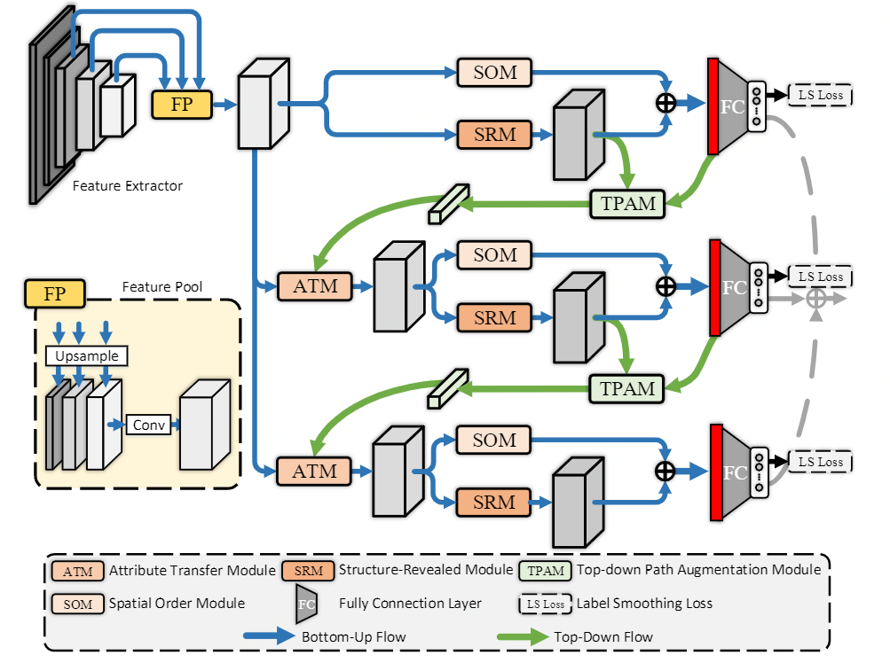
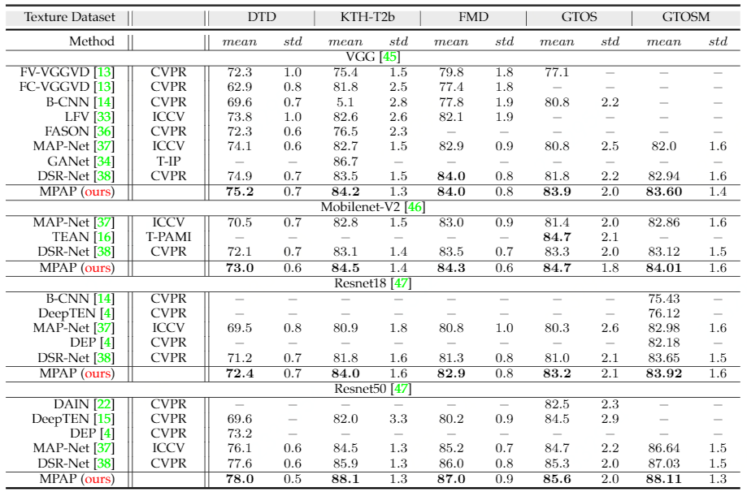

# Texture Classification

PyTorch implementation of On Exploring Multiplicity of Primitives and Attributes for Texture Recognition in the Wild.

> **Authors:** 
> Wei Zhai, 
> Yang Cao, 
> Jing Zhang, 
> Haiyong Xie, 
> Zheng-Jun Zha &
> Dacheng Tao.

## Contents

- [On Exploring Multiplicity of Primitives and Attributes for Texture Recognition in the Wild](#Texture-Classification)
  + [Abstract](#Abstract)
  + [Table of Contents](#Table-of-Contents)
  + [Motivation](#Motivation)
  + [Overview](#Overview)
  + [File Structure](#File-Structure)
  + [Requirements](#Requirements)
  + [Dataset](#Dataset)
  + [Usage](#Usage)
  + [Results](#Results)
  + [Statement](#Statement)
  + [Citation](#Citation)

## Abstract

Texture recognition is a challenging visual task since its multiple primitives or attributes can be perceived from the texture image under different spatial contexts. Existing approaches predominantly built upon CNN incorporate rich local descriptors with orderless aggregation to capture invariance to the spatial layout. However, these methods ignore the inherent structure relation organized by primitives and the semantic concept described by attributes, which are critical cues for texture representation. In this paper, we propose a novel Multiple Primitives and Attributes Perception network (MPAP) that extracts features by modeling the relation of bottom-up structure and top-down attribute in a multi-branch unified framework. A bottom-up process is firstly proposed to capture the inherent relation of various primitive structures by leveraging structure dependency and spatial order information. Then, a top-down process is introduced to model the latent relation of multiple attributes by transferring attribute-related features between adjacent branches. Moreover, an augmentation module is devised to bridge the gap between high-level attributes and low-level structure features. MPAP can learn representation through jointing bottom-up and top-down processes in a mutually reinforced manner. Experimental results on five challenging texture datasets demonstrate the superiority of MPAP over state-of-the-art methods in terms of accuracy, robustness, and efficiency.

## Motivation


<p align="center">
     <br />
    <em> 
    </em>
</p>

**Illustration of multiplicity of texture.** Part (A) shows that textures usually have several probable primitives in the local neighborhood. Part (B) shows that textures usually have multiple visual texture attributes.

<p align="center">
     <br />
    <em> 
    </em>
</p>

**Motivation.** To overcome the problem of multiplicity of texture, we need to model attributes relation and structure relation together. The left part shows the mechanism of modeling structure relation that an inherent spatial dependency between several probable primitives. The right part shows the mechanism of modeling attributes relation that a texture image has multiple visual texture attributes correlated with each other.

## Overview

<p align="center">
     <br />
    <em> 
    </em>
</p>

**The architecture of our proposed Multiple Primitives and Attributes Perception network (MPAP).** MPAP has a multi-branch CNN structure. Each branch can be divided into three parts: feature extractor, local structure modeling, and feature aggregation, which specifically model bottom-up structure relation. Between two neighboring branches, a top-down attribute relation module is devised, which is leveraged as guidance for learning the spatial feature. To bridge the gap between global content and local features, a top-down path augmentation module is proposed to facilitate the attribute transfer process.

## File Structure
	Texture_Classification
	├── Datasets
	│   ├── DTD dataset need
	│   ├── ...
	│   └── GTOSM dataset need
	├── Images
	│   ├── DTD dataset
	│   ├── ...
	│   └── GTOSM dataset
	├── Model
	│   ├── DTD
	│   ├── ...
	│   └── GTOSM
	├── Network
	│   ├── Deform_Conv.py
	│   ├── LabelSmoothingLoss.py
	│   └── MPAP_network.py
	├── StyleTransferImage
	│   ├── content
	│   └── style
	├── Util
	│   ├── AUG.py
	│   └── lr_scheduler.py
	├── classification_image_loader.py
	├── Count.py
	├── ECE_test.py
	├── FGSM.py
	├── MPAPNet.py
	├── README.md
	├── StyleTransfer.py
	├── train_test_MPAP.sh
	└── transforms.py

## Requirements

- Python == 3.7 
- Pytorch == 1.7.0 ( [http://pytorch.org](http://pytorch.org) )
- Torchvision == 0.5.0
- Cuda ==11.0 ( [https://developer.nvidia.com/zh-cn/cuda-toolkit](https://developer.nvidia.com/zh-cn/cuda-toolkit) )
- Wandb ( [https://wandb.ai/site](https://wandb.ai/site) )
- Opencv
- Sklearn

## Dataset

- Describable Textures Dataset (DTD) ([https://www.robots.ox.ac.uk/~vgg/data/dtd/](https://www.robots.ox.ac.uk/~vgg/data/dtd/))
- Flickr Material Database (FMD) ([https://people.csail.mit.edu/celiu/CVPR2010/FMD/](https://people.csail.mit.edu/celiu/CVPR2010/FMD/))
- KTH-TIPS (KTH) ([https://www.csc.kth.se/cvap/databases/kth-tips/credits.html](https://www.csc.kth.se/cvap/databases/kth-tips/credits.html))
- Ground Terrain in Outdoor Scenes (GTOS) ([https://www.ece.rutgers.edu/~kdana/gts/gtos.html](https://www.ece.rutgers.edu/~kdana/gts/gtos.html))
- Ground Terrain in Outdoor Scenes mobile (GTOSM) ([https://drive.google.com/file/d/1Hd1G7aKhsPPMbNrk4zHNJAzoXvUzWJ9M/view](https://drive.google.com/file/d/1Hd1G7aKhsPPMbNrk4zHNJAzoXvUzWJ9M/view))

## Usage

```
usage: MPAPNet_test.py [-h] [--dataset DATASET] [--backbone BACKBONE]
                       [--tag TAG] [--fold FOLD] [--classes CLASSES]
                       [--num_workers NUM_WORKERS] [--gpuname GPUNAME]
                       [--batch_size N] [--test_batch_size N]
                       [--epochs EPOCHS] [--lr LR] [--momentum M]
                       [--accumulation_steps ACCUMULATION_STEPS] [--mixup]
                       [--alpha ALPHA] [--labelsmoothing] [--smooth SMOOTH]
                       [--randearP RANDEARP] [--randhorP RANDHORP]
                       [--randverP RANDVERP] [--randperP RANDPERP]
                       [--randaugP RANDAUGP] [--randcutP RANDCUTP]
                       [--mixupP MIXUPP] [--a A] [--b B] [--c C] [--seed]
                       [--saveweight] [--savebestweight]
                       [--distributedsampler] [--no_cuda] [--log_interval N]
                       [--tsne] [--cm] [--ece] [--cam]
                       [--local_rank LOCAL_RANK] [--init_method INIT_METHOD]
                       [--rank RANK] [--word_size WORD_SIZE] [--FGSM] [--PGD]
                       [--adv_iter ADV_ITER] [--bins BINS]
                       [--randcutPtest RANDCUTPTEST]
                       [--cutoutsizetest CUTOUTSIZETEST] [--noncenter]


PyTorch Texture Classification Training
optional arguments:
  -h, --help                        # show this help message and exit
  --dataset DATASET
  --backbone BACKBONE
  --tag TAG
  --fold FOLD
  --classes CLASSES
  --num_workers NUM_WORKERS
  --gpuname GPUNAME
  --batch_size N                    # input batch size for training (default: 32)
  --test_batch_size N               # input batch size for testing (default: 2)
  --epochs EPOCHS                   # training epoch
  --lr LR                           # learning rate (default: 0.001)
  --momentum M                      # SGD momentum (default: 0.5)
  --accumulation_steps 1            # Gradient accumulation steps
  --mixup                           # enables mixup
  --alpha ALPHA                     # interpolation strength (uniform=1., ERM=0.)
  --labelsmoothing                  # enables label smoothing
  --smooth SMOOTH                   # smooth factor
  --randearP RANDEARP               # probability of randearP
  --randhorP RANDHORP               # probability of randhorP
  --randverP RANDVERP               # probability of randverP
  --randperP RANDPERP               # probability of randperP
  --randaugP RANDAUGP               # probability of randaugP
  --randcutP RANDCUTP               # probability of randcutP
  --mixupP MIXUPP                   # probability of mixupP
  --a A                             # branch weight
  --b B                             # branch weight
  --c C                             # branch weight
  --seed                            # hold seed
  --saveweight                      # enables save model
  --savebestweight                  # enables save best model
  --distributedsampler              # enables distributed sampler
  --no_cuda                         # enables CUDA training
  --log_interval N                  # how many batches to wait before logging training status
  --tsne                            # show the result of tsne
  --cm                              # show the confusion matrix
  --ece                             # show the result of ece
  --cam                             # show the class activation map
  --local_rank LOCAL_RANK
  --init_method INIT_METHOD 
  --rank RANK                       # rank of current process
  --word_size WORD_SIZE             # word size
  --FGSM                            # evalute FGSM robustness
  --PGD                             # evalute PGD robustness
  --adv_iter ADV_ITER               # PGD iters
  --bins BINS
  --randcutPtest RANDCUTPTEST       # Random Cutout Test
  --cutoutsizetest CUTOUTSIZETEST   # The mask size of random cutout test
  --noncenter
```

To train a model, run `Train.py` with the desired model:

```bash
python MPAPNet_test.py --dataset DTD --fold 1 --tag 10 --batch_size 128 --accumulation_steps 1 --test_batch_size 8 --epochs 200 --labelsmoothing --a 0.5 --b 0.3 --c 0.2 --backbone resnet50 --lr 0.001
```

## Cross-Validation:

To do cross-validation, run `train_test_MPAP.sh`, you need to give:

* DTD dataset:

```bash
a="DTD"               # dataset name
N=10                  # k-fold
```

* FMD dataset:

```bash
a="FMD"               # dataset name
N=10                  # k-fold
```

* KTH dataset:

```bash
a="KTH"               # dataset name
N=4                   # k-fold  x 10
```

* GTOS dataset:

```bash
a="GTOS"              # dataset name
N=5                   # k-fold
```

* GTOSM dataset:

```bash
a="GTOSM"             # dataset name
N=1                   # k-fold  x 2
```

Then run:

```bash
sh train_test_MPAP.sh
tag:#0
```

## Results

<p align="center">
     <br />
    <em> 
    The results (Acc %) of our method and state-of-the-arts methods on DTD, KTH-T2b, FMD, GTOS and GTOS-mobile. We use four different backbones including VGG, Mobilenet-V2, Resnet18, and Resnet50. 
    </em>
</p>

## Style Transfer

Style transfer image generation. In this paper, we use a classical method [https://arxiv.org/pdf/1508.06576.pdf](https://arxiv.org/pdf/1508.06576.pdf) as our baseline method:

```bash
python StyleTransfer.py --loadour --content // --style //
```

## Statement
This project is for research purpose only, please contact us for the licence of commercial use. For any other questions please contact [wzhai056@mail.ustc.edu.cn](wzhai056@mail.ustc.edu.cn).

## Citation: 

```bash
@inproceedings{zhai2020deep,
  title={Deep Structure-Revealed Network for Texture Recognition},
  author={Zhai, Wei and Cao, Yang and Zha, Zheng-Jun and Xie, HaiYong and Wu, Feng},
  booktitle={Proceedings of the IEEE/CVF Conference on Computer Vision and Pattern Recognition},
  pages={11010--11019},
  year={2020}
}
```

```bash
@inproceedings{zhai2019deep,
  title={Deep multiple-attribute-perceived network for real-world texture recognition},
  author={Zhai, Wei and Cao, Yang and Zhang, Jing and Zha, Zheng-Jun},
  booktitle={Proceedings of the IEEE/CVF International Conference on Computer Vision},
  pages={3613--3622},
  year={2019}
}
```

```bash
@inproceedings{xx,
  title={On exploring multiplicity of primitives and attributes for texture recognition in the wild},
  author={Zhai, Wei and Cao, Yang and Zhang, Jing and Zha, Zheng-Jun and Xie, Haiyong and Tao, Dacheng},
  booktitle={xxx},
  year={xxx}
}
```
